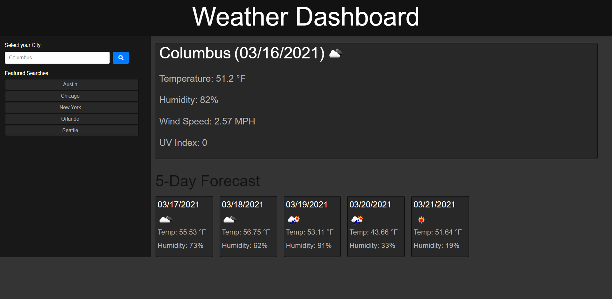

# homework06 : Weather Dashboard

## My Task

Your challenge is to build a weather dashboard that will run in the browser and feature dynamically updated HTML and CSS.

Use the OpenWeather API to retrieve weather data for cities. The documentation includes a section called "How to start" that provides basic setup and usage instructions. You will use localStorage to store any persistent data.

## Brief

```md
AS A traveler
I WANT to see the weather outlook for multiple cities
SO THAT I can plan a trip accordingly
```

## Acceptance Criteria

```md
GIVEN a weather dashboard with form inputs
WHEN I search for a city
THEN I am presented with current and future conditions for that city and that city is added to the search history
WHEN I view current weather conditions for that city
THEN I am presented with the city name, the date, an icon representation of weather conditions, the temperature, the humidity, the wind speed, and the UV index
WHEN I view the UV index
THEN I am presented with a color that indicates whether the conditions are favorable, moderate, or severe
WHEN I view future weather conditions for that city
THEN I am presented with a 5-day forecast that displays the date, an icon representation of weather conditions, the temperature, and the humidity
WHEN I click on a city in the search history
THEN I am again presented with current and future conditions for that city
```

## Completed Work

While creating this weather dashboard I:

* Used two OpenWeather API's to retrieve weather data

* Created two displays, one displaying current weather and the other displaying 5 day's of forecasted weather

* Added non-responsive basic styling for mvp 

* Made functional buttons for both featured and saved searches

* Used localStorage to render past searches on page load

* Created a form to allow user input's 

* Completed with zero errors in the console

## Screenshot



## Links

Deployed Application(GitHub Pages): https://mkotte.github.io/homework06/

GitHub Repository: https://github.com/mkotte/homework06
